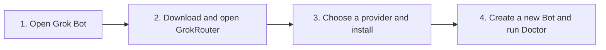
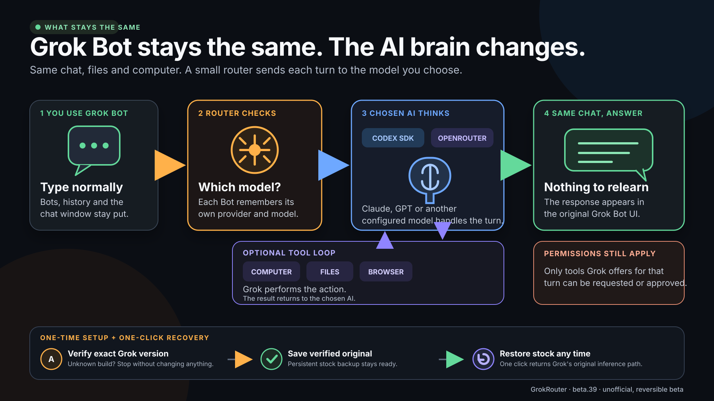

<p align="center">
  
</p>

<h1 align="center">GrokRouter</h1>

<p align="center">
  <strong>Bring your own model to Grok Bot.</strong><br>
  Route the official Grok Bot desktop app through the Codex SDK or OpenRouter<br>
  without giving up its chat, Bots, files, computer, or tool boundary.
</p>

<p align="center">
  
  
  
  
</p>

> [!IMPORTANT]
> GrokRouter is an experimental, unofficial, reversible project for **Grok Bot 0.30.0 only**. If GrokRouter reports an unsupported or changed version, stop. Never force it past that check.

## What does it do?

You keep using the normal Grok Bot app. GrokRouter lets an individual Bot use the Codex SDK or a model from OpenRouter as its AI brain.

| You keep | You choose |
| --- | --- |
| Grok Bot's desktop app and chat | Codex SDK or OpenRouter |
| Existing Bots and conversations | A different provider per Bot |
| Cloud computer, files, browser, and permissions | A different model and reasoning level per Bot |
| Grok's outer tool-execution boundary | Stock Grok again at any time |

It is reversible: **Restore Stock Grok Bot** puts the verified original inference path back.

## Start here: get it working on a Mac

> [!TIP]
> **Just want it working? Follow the four numbered steps below and stop. Everything after “Give this repository to your AI assistant” is optional technical detail.**



### Before you start: four yes-or-no checks

Continue only if every answer is **yes**:

- **Mac:** You have an Apple-silicon Mac—M1, M2, M3, M4, or newer—running macOS 12 or later.
- **Grok Bot:** The official **Grok Bot 0.30.0** app is inside your Mac's main `Applications` folder.
- **Bot computer:** You can select a Bot in Grok Bot and click **Open computer**.
- **Model access:** You have a Codex account, an OpenRouter API key beginning with `sk-or-v1-`, or both.

Windows builds exist for developers to inspect, but Windows is not yet the beginner installation path.

### 1. Open Grok Bot

Open the official Grok Bot app. Select any Bot, click **Open computer**, and leave Grok Bot open.

### 2. Install and open GrokRouter

The fastest path is one pinned command. Open your Mac's **Terminal**, paste this entire line, and press Return:

```bash
/usr/bin/curl --fail --silent --show-error --location https://raw.githubusercontent.com/promptadvisers/grokrouter/source-v0.1.0-beta.44/scripts/install-macos.sh --output /tmp/grokrouter-install.sh && /bin/bash /tmp/grokrouter-install.sh
```

It downloads the exact tagged source, builds GrokRouter locally, verifies it, installs it in your Applications folder, and opens it. It does not use `sudo`.

If you prefer not to paste a Terminal command, use the equivalent ZIP path:

1. Click the green **Code** button near the top of this GitHub page.
2. Click **Download ZIP**.
3. Open your Mac's **Downloads** folder and double-click the downloaded ZIP.
4. Open the new folder whose name starts with `grokrouter` (usually `grokrouter-main`).
5. Double-click **Install GrokRouter.command**. Keep the Terminal window open while it builds.

The process is finished when Terminal says:

```text
GrokRouter is installed in your Applications folder. Opening it now...
```

If macOS installs Apple Command Line Tools first, let that finish and then run the same Terminal command again—or double-click **Install GrokRouter.command** again if you used the ZIP path. If macOS asks whether to open the downloaded command, Control-click it, choose **Open**, and confirm **Open**. You never need to disable Gatekeeper or use `sudo`.

### 3. Choose your model and click Install Router

Pick the row that matches what you have:

| What you have | What to select |
| --- | --- |
| A Codex account | Keep **Codex SDK** checked. You can uncheck OpenRouter. Select **Codex SDK** as the default. |
| An OpenRouter key | Keep **OpenRouter** checked, paste the complete `sk-or-v1-...` key, and select **OpenRouter** as the default. |
| Both | Keep both checked, paste your OpenRouter key, and choose whichever provider you want new Bots to use first. |

Click **Install Router** and wait. Do not close Grok Bot or GrokRouter.

- If GrokRouter asks for a Bot computer, return to Grok Bot, select any Bot, and click **Open computer**.
- If you selected Codex, click **Start Codex Sign-in** after installation and complete the sign-in shown in the Bot terminal.
- Your OpenRouter key is sent directly to Grok Bot's protected Secrets store and cleared from the installer field.

The installer has finished when its log shows a line beginning with `✓ Installed`.

### 4. Prove it works in a brand-new Bot

Create a **new Bot after installation**. In that Bot's normal chat box, send these one at a time:

```text
/router doctor
/provider
```

You are done when:

- Doctor starts with `Router ...: OK`.
- `/provider` names the provider and model you selected.
- A normal message in that same Bot receives a normal answer.

From now on, stay inside Grok Bot. You do not need to keep GrokRouter open.

## If something goes wrong

| What you see | What to do |
| --- | --- |
| Apple Command Line Tools are required | Finish Apple's installation, then repeat whichever installation path you used. |
| macOS will not open the command | Control-click **Install GrokRouter.command**, choose **Open**, then confirm **Open**. Do not disable Gatekeeper. |
| `install Grok Bot 0.30.0 in Applications first` | Put the official app at `/Applications/Grok Bot.app`, open it once, then retry. |
| Unsupported or changed Grok Bot version | Stop. Do not force the installation or change the version/hash checks. |
| GrokRouter asks for a Bot computer | In Grok Bot, select any Bot and click **Open computer**. Leave it open while the installer continues. |
| `Action needed` appears | Follow the large instruction in GrokRouter. It continues automatically after the Bot computer is available. |
| Installation stopped while downloading dependencies | Confirm the Bot computer has internet access, then click **Try installation again**. |
| Installation stopped with another error | Click **Copy safe diagnostics** and paste the report into a GitHub issue. It excludes credentials, conversations, and Bot files. |
| Codex is not signed in | Open GrokRouter, click **Start Codex Sign-in**, and complete the displayed device flow. |
| OpenRouter reports a credential problem | Paste the complete key beginning with `sk-or-v1-`, without spaces before or after it. |
| GrokRouter was working and then stopped | Open GrokRouter, click **Run Doctor**, then **Repair Router**. If you want to undo everything, click **Restore Stock Grok Bot**. |

If Doctor still reports a failure, copy its complete non-secret output into an [installation support issue](https://github.com/promptadvisers/grokrouter/issues/new?template=installation-failure.yml) or give it to your AI assistant. Never post an API key.

## Everyday commands

Type these into a Bot's normal Grok chat box:

| Command | Plain-English meaning |
| --- | --- |
| `/models` | Show the models you can use. |
| Paste a listed `vendor/model` ID | Switch this Bot to that model. |
| `/provider` | Show which provider and model this Bot is using. |
| `/reasoning low\|medium\|high\|xhigh` | Change Codex thinking effort. |
| `/router reset` | Start a fresh provider thread without deleting the Grok conversation. |
| `/router doctor` | Check whether the installation, provider, and credentials are healthy. |

Each Bot keeps its own provider and model choice.

## Give this repository to your AI assistant

Paste this prompt into Codex, Claude Code, or another coding assistant that can read the repository:

```text
Help me install and verify GrokRouter from this repository. Read README.md and
AGENTS.md first. Walk me through one step at a time in plain English. Before
changing anything, confirm that this is an Apple-silicon Mac on macOS 12 or
later and that /Applications/Grok Bot.app is exactly version 0.30.0. Never
bypass an unsupported-version, hash, signature, or source-anchor check. Use the
documented installer and recovery paths only. After installation, help me create
a brand-new Bot and verify /router doctor and /provider. If anything fails,
explain the exact failure without exposing API keys or other secrets.
```

---

<details>
<summary><strong>Optional: technical architecture, builds, complete commands, safety, and release evidence</strong></summary>

Everything below is for developers, auditors, and AI assistants. A normal user does not need it to install or use GrokRouter.

## How it works



1. The platform installer verifies the exact supported Grok Bot build.
2. It opens a loopback-only diagnostic session and operates the visible Bot computer through Grok's existing noVNC connection.
3. A checksummed bootstrap installs the pinned runtime and saves a verified stock backup.
4. A deliberately small host adapter redirects inference to GrokRouter.
5. The selected provider answers—or requests one of the tools Grok actually offered.
6. Grok remains responsible for permissions, tool execution, and delivering the final response in chat.

The provider cannot invent tool authority. Printed pseudo-tool markup stays inert unless it can be mapped to the exact schema Grok offered for that turn.

For the friendly explanation, read [How it works](docs/HOW-IT-WORKS.md). For implementation details, read [Architecture](docs/ARCHITECTURE.md).

## Platform status

| Platform | Current evidence |
| --- | --- |
| macOS 12+, Apple silicon | The exact beta.39 app installed successfully and a genuinely new Bot passed Doctor and provider selection. The preceding beta.38 candidate passed install → restore → reinstall. |
| Windows 11, x64 and Arm64 | Native Electron installer, exact signed-app/version gate, loopback/noVNC transport, restore path, packaging tests, and both ZIP and Inno Setup architectures build on the Windows CI runner. Native launch/install and live Grok Bot acceptance remain required before a public Windows claim. |

The detailed claim ledger lives in the [test matrix](docs/TEST-MATRIX.md). macOS is the live-verified platform; Windows is a source preview until its native acceptance cycle passes.

The installer transfers a small checksummed bootstrap through the Bot computer, installs pinned dependencies inside that computer, preserves a stock host backup, closes its temporary diagnostic connection, and reopens Grok Bot normally.

## Build the installers yourself

Anyone can inspect and build the Mac or Windows installer from this repository for personal, non-commercial use. The native platform shells, remote bootstrap, provider runtime, patch engine, exact compatibility manifest, tests, and recovery path are all included. Grok Bot's proprietary host source is not included or required in the repository.

### What you need

- For Mac: macOS 12+ on Apple silicon and Xcode Command Line Tools, including Swift and `codesign`
- For Windows: Windows 11 x64 or Arm64, Git Bash, PowerShell, Node.js 22.12+, and Inno Setup 6 for a native Setup executable
- Node.js 18 or newer and Python 3 for the shared runtime development suite

### Build commands

After cloning or downloading this repository, open its `grokrouter` folder in Terminal and run:

```bash
npm ci --prefix runtime --ignore-scripts --no-audit --no-fund
npm test
```

Build the macOS package on a Mac:

```bash
npm run build:macos
```

The app and checksum file appear in `build/`. A local source build is ad-hoc signed for your own Mac.

Build a Windows ZIP from macOS or Windows, or build the native Setup executable on Windows:

```bash
npm run test:windows
npm run build:windows -- x64
npm run build:windows -- arm64
```

The Windows CI job runs on Windows Server, requires both Inno Setup artifacts, and uploads x64 and Arm64 ZIPs plus checksums. Authenticode signing is optional for private source builds. A public release must set `ROUTER_WINDOWS_REQUIRE_SIGNING=1` with its certificate variables; that mode fails closed before packaging if either credential is missing.

If the packaged installer UI or delivery mechanism fails, start with these files:

| Area to change | Source |
| --- | --- |
| Mac installer | `installer/GrokBotRouterInstaller.swift` |
| Mac packaging | `scripts/build-macos-app.sh` |
| Windows installer | `installer-windows/` |
| Windows packaging and signing | `scripts/build-windows-app.sh`, `scripts/build-windows-setup.ps1`, `scripts/sign-windows.ps1` |
| Files delivered into the Bot computer | `scripts/build-payload.sh`, `remote/install.sh` |
| Exact supported Grok build | `patch/manifests/0.30.0.json`, `patch/router_patch.py` |
| Provider behavior | `runtime/run-provider.mjs` |
| Required proof before calling a build usable | `docs/FRESH-BOT-ACCEPTANCE.md`, `docs/TEST-MATRIX.md` |

Building the source yourself can fix packaging, signing, UI, or machine-specific delivery problems. It does **not** automatically support a different Grok Bot release. A new Grok version needs a new exact manifest, a reviewed transformation, all tests, and the complete live install → restore → reinstall → fresh-Bot acceptance cycle.

Personal, non-commercial source builds are allowed. Redistribution is not. See [the license](LICENSE.md).

## Prove it with a brand-new Bot

Create a Bot **after** installation and send:

```text
/router doctor
/models
openai/gpt-5.6-luna
/provider
```

The bare model ID is intentional: copy any listed OpenRouter model from `/models` and paste it directly into the composer. The final receipt must name OpenRouter and `openai/gpt-5.6-luna`.

This is the minimum proof, not the whole release gate. The authoritative sequence is [Fresh-Bot Acceptance](docs/FRESH-BOT-ACCEPTANCE.md).

## Chat controls

Type these into Grok Bot's normal composer. The installer publishes user-invocable skill descriptors for `/provider`, `/models`, `/model`, `/reasoning`, `/router`, and `/doctor`, so Grok can list the real commands in its native slash-suggestion menu. The skills only provide discovery; the router runtime still handles every recognized command deterministically before model inference. If a user skill already owns one of those names, installation preserves it and Doctor reports the conflict instead of overwriting it.

| Command | What it does |
| --- | --- |
| `/provider` | Show this Bot's provider and model |
| `/provider codex` | Switch this Bot to the Codex SDK |
| `/provider openrouter` | Switch this Bot to OpenRouter |
| `/models` | Show the configured model catalog |
| `/model sol` | Select the Codex `gpt-5.6-sol` alias |
| `/model anthropic/claude-sonnet-4.6` | Select a specific OpenRouter model |
| `/models openai/gpt-5.6-luna` | Forgiving plural alias that switches models |
| `openai/gpt-5.6-luna` | Paste a listed OpenRouter model ID by itself |
| `/reasoning minimal\|low\|medium\|high\|xhigh` | Change Codex reasoning effort |
| `/router reset` | Start a fresh provider thread without deleting the Grok transcript |
| `/router doctor` | Report runtime, patch, provider, and credential health |
| `/doctor` | Short alias for `/router doctor` |
| `/router help` | Show the command reference |

Invalid or near-miss model controls return bounded help instead of becoming model prompts.

## Everything in the system

| Component | Source | Responsibility |
| --- | --- | --- |
| macOS installer | `installer/GrokBotRouterInstaller.swift` | Native Swift UI, app/version gate, loopback diagnostics, Vision OCR, noVNC transport, install, Doctor, repair, and restore |
| App identity | `installer/Info.plist`, `installer/Assets/` | GrokRouter name, mascot, and macOS icon resources |
| Payload builder | `scripts/build-payload.sh` | Creates the small checksummed archive sent into the Bot computer |
| Source installer | `scripts/install-macos.sh`, `Install GrokRouter.command` | Builds locally, verifies the app, and installs it without `sudo` |
| Mac builder | `scripts/build-macos-app.sh` | Produces the native app, optional ZIP, and SHA-256 file |
| Windows installer | `installer-windows/` | Sandboxed Electron UI, signed-app/version gate, loopback diagnostics, Tesseract OCR, install, Doctor, repair, and restore |
| Windows builder | `scripts/build-windows-app.sh` | Produces x64/Arm64 apps, clean ZIPs, native Inno Setup executables on Windows, checksums, and optional Authenticode signatures |
| Remote bootstrap | `remote/install.sh` | Idempotently installs pinned dependencies, config, CLI, runtime, patch, and watchdog inside the Bot computer |
| Slash discovery skills | `skills/` | Publish the deterministic router controls through Grok's user-invocable skill menu without replacing conflicting user skills |
| Management CLI | `remote/grokbot-router` | Status, enable, disable, repair, Doctor, and verified stock uninstall |
| Lifecycle watchdog | `remote/grokbot-router-watchdog` | Rate-limited repair when Grok replaces the live host with a known stock build; never repairs an unknown build or intentional restore |
| Compatibility manifests | `patch/manifests/` | Exact Grok version, stock-host SHA-256 allowlist, size, and required source anchors |
| Patch engine | `patch/router_patch.py` | Original transformation, syntax check, atomic activation, verified backup, dry run, and restore |
| Provider runtime | `runtime/run-provider.mjs` | Controls, stable Bot identity, per-Bot state, replay protection, Codex/OpenRouter adapters, tool conversion, and redacted audit |
| Provider defaults | `runtime/provider.default.json` | Packaged provider/model catalog and installer defaults—never credentials |
| Automated tests | `tests/` | Runtime behavior, patch/restore, payload integrity, and native installer contracts |
| CI | `.github/workflows/ci.yml` | Runs the Mac suite/build and native Windows x64/Arm64 package builds on every push and pull request |
| Evidence and operating docs | `docs/` | Architecture, acceptance, test matrix, security/release guidance, diagrams, independent review, and demo runbook |

No proprietary Grok host source is committed or bundled. The repository contains the original transformation and exact compatibility metadata only.

## Repair, pause, or restore

The installer exposes the recovery path directly:

- **Run Doctor** checks the installed version, patch status, providers, protected credential shape, Node, and the tool bridge.
- **Repair Router** reapplies the adapter only if the live host is an exact allowlisted stock build.
- **Restore Stock Grok Bot** verifies the persistent stock backup, restores it atomically, disables automatic repair, and restarts the host.

The same controls are available inside the Bot computer:

```bash
grokbot-router status
grokbot-router doctor
grokbot-router disable
grokbot-router enable
grokbot-router repair
grokbot-router uninstall
```

`disable` keeps the adapter installed but sends new sessions through the stock inference path. `uninstall` restores the verified stock host while retaining the runtime and backup for recovery.

## Safety by construction

- **Exact compatibility:** the patch requires a supported app version, allowlisted stock-host SHA-256, expected size, and exact source anchors.
- **Fail closed:** an unknown hash, missing anchor, invalid generated host, invalid credential shape, or unverified terminal stops the operation.
- **Reversible:** verified stock and timestamped pre-change backups exist before activation.
- **Atomic:** generated JavaScript is syntax-checked and replaced atomically; failed activation restores the previous runtime.
- **Checksummed:** release ZIPs have external SHA-256 files and the payload validates every internal member.
- **Local installer bridge:** Electron diagnostics bind to `127.0.0.1` and are closed after every operation.
- **No broad OS permissions:** the installers do not request Accessibility, Screen Recording, or Full Disk Access.
- **Protected secrets:** OpenRouter keys go directly to Grok Bot Secrets and are excluded from repository files, provider state, release artifacts, and audit logs.
- **Bounded tools:** only schemas offered by Grok for the current turn can cross the tool bridge.
- **Honest evidence:** code-level capability, live verification, and blocked claims are recorded separately.

Read [Security](SECURITY.md) before distributing access.

## Development

```bash
npm ci --prefix runtime --ignore-scripts --no-audit --no-fund
npm test
npm run build:macos
npm run build:windows -- x64
npm run build:windows -- arm64
```

`npm test` covers the provider runtime, patch/restore engine, complete payload install, and native installer contracts.

Build outputs go under `build/`:

```text
grokrouter-<version>-macos.zip
grokrouter-<version>-macos.zip.sha256
grokrouter-<version>-windows-x64.zip
grokrouter-<version>-windows-x64.zip.sha256
grokrouter-<version>-windows-arm64.zip
grokrouter-<version>-windows-arm64.zip.sha256
grokrouter-<version>-windows-<arch>-setup.exe   # native Windows build
```

Local Mac builds are ad-hoc signed for the Mac that built them. Windows source and CI artifacts are unsigned unless an Authenticode certificate is supplied; explicit Windows release mode fails closed without one. GrokRouter does not ask viewers to bypass Gatekeeper or Windows signature warnings.

Coding agents must begin with [AGENTS.md](AGENTS.md). It defines the authoritative files, protected safety boundaries, verification commands, and fresh-Bot acceptance gate.

## Release truth

Beta.44 makes setup failures recoverable instead of leaving the installer spinning: numbered phases, a clear action-needed state, bounded diagnostic and network operations, one-click retry, safe diagnostics, fresh diagnostic sessions after a Bot-computer swap, verified dependency reuse, and an OpenRouter-only path with no Codex download.

The exact local macOS beta.44 lifecycle completed install → verified stock restore → reinstall. A genuinely new Bot passed Doctor, model switching, provider identity, deterministic near-miss controls, exact-once text delivery, and second-Bot state isolation. The Windows x64 and Arm64 applications build and checksum successfully from current source, but have not yet passed a native Windows install → restore → reinstall → fresh-Bot cycle. Full OpenRouter computer/sub-agent parity is not claimed when Grok supplies no actionable outer-tool schemas.

See [Release Notes](RELEASE_NOTES.md), [Test Matrix](docs/TEST-MATRIX.md), and the dated [Independent Review](docs/INDEPENDENT-REVIEW-2026-08-29.md) for the evidence behind every claim.

## Documentation

- [How it works, without the jargon](docs/HOW-IT-WORKS.md)
- [Technical architecture](docs/ARCHITECTURE.md)
- [Fresh-Bot acceptance gate](docs/FRESH-BOT-ACCEPTANCE.md)
- [Verification matrix](docs/TEST-MATRIX.md)
- [Security and trust boundary](SECURITY.md)
- [Source-build and release procedure](docs/RELEASE.md)
- [OpenGrok comparison](docs/OPENGROK-COMPARISON.md)
- [YouTube demo runbook](docs/YOUTUBE-DEMO.md)
- [Editable 16:9 architecture diagram](docs/diagrams/grokbot-router-end-to-end.svg)
- [4K architecture export](docs/diagrams/grokbot-router-end-to-end-4k.png)

## Current scope

GrokRouter is deliberately narrow. Adding another Grok Bot version requires inspecting the untouched stock host, recording its exact hash and size, confirming every patch anchor exactly once, running the complete automated suite, and completing the live install → restore → reinstall → fresh-Bot gate on each claimed platform.

Never add a wildcard hash. Never ship a development override. Never call a preview verified.

</details>

---

<p align="center">
  <strong>GrokRouter</strong><br>
  The official Grok Bot stays in charge. You choose the model.
</p>
